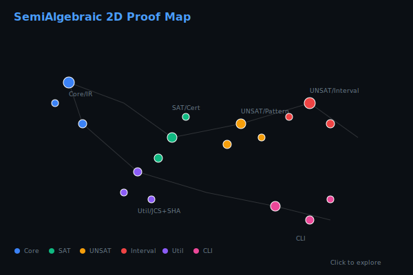
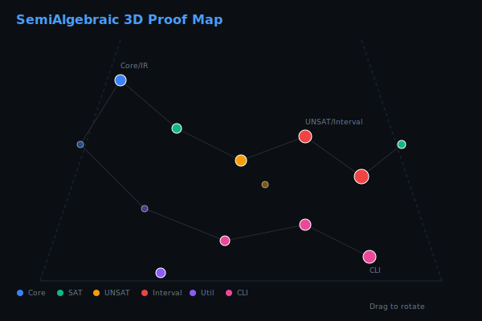
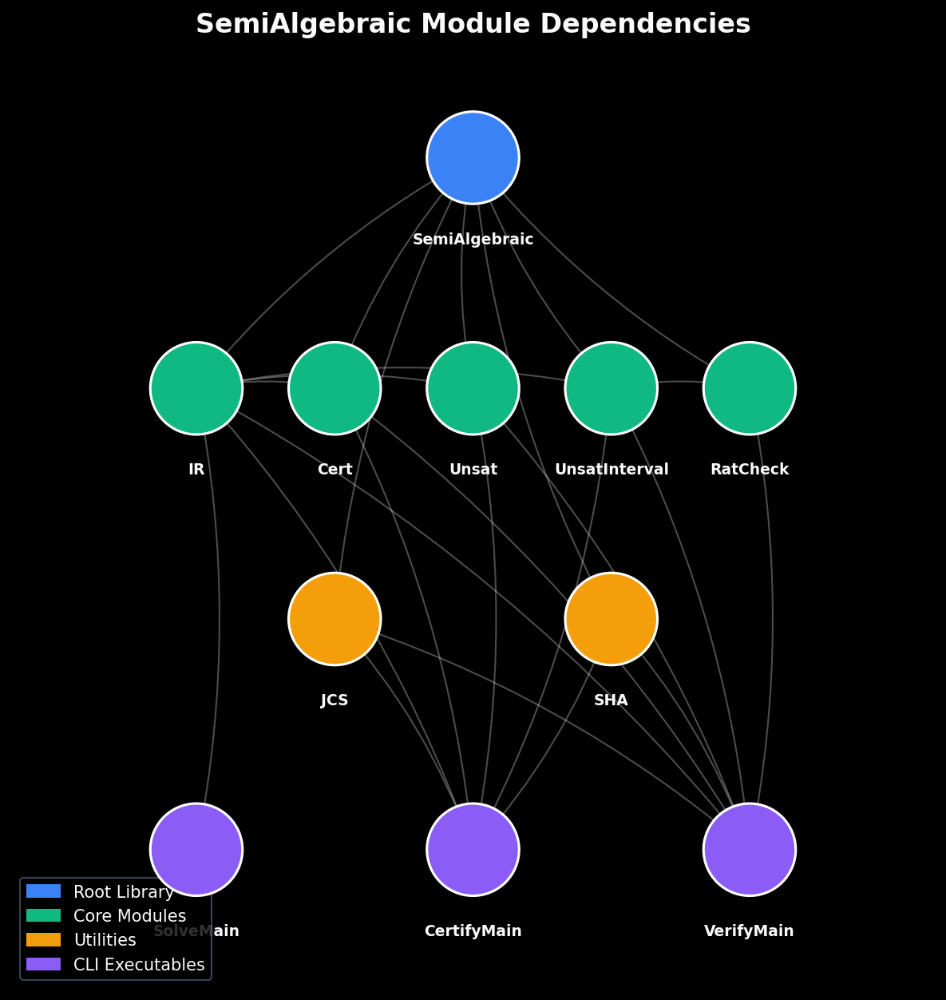
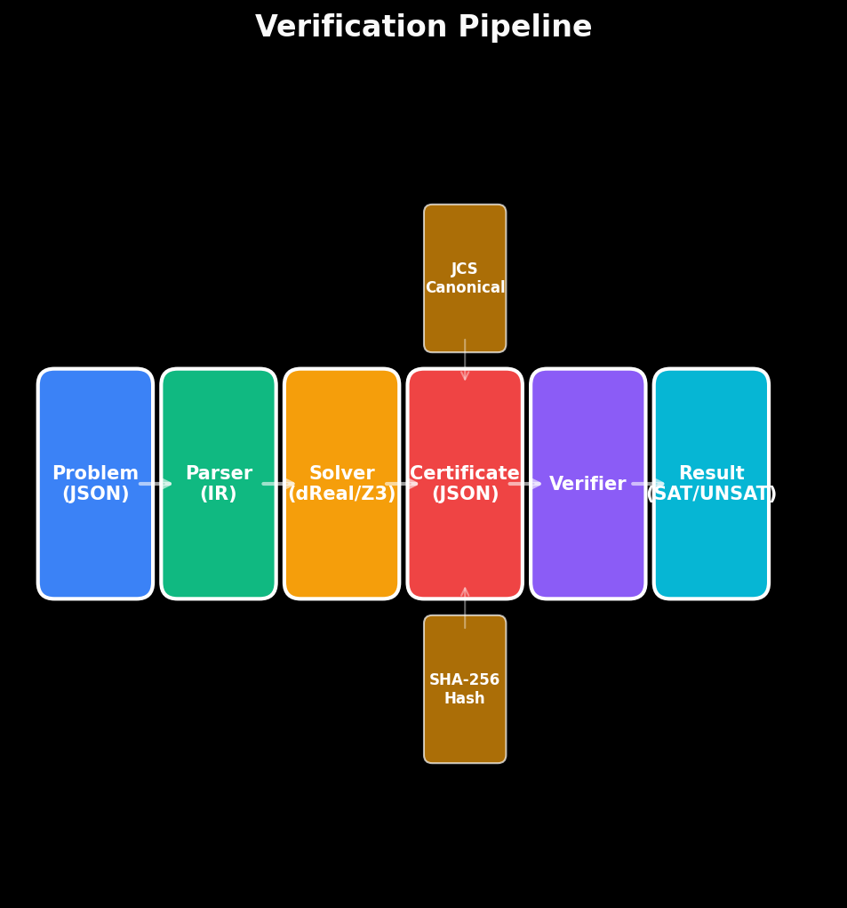

<sub><strong>Our tech stack is ontological:</strong><br>
<strong>Hardware — Physics</strong><br>
<strong>Software — Mathematics</strong><br><br>
<strong>Our engineering workflow is simple:</strong> discover, build, grow, learn & teach</sub>

---

<sub>
<strong>Notice of Proprietary Information</strong><br>
This document outlines foundational concepts and methodologies developed during internal research and development at Apoth3osis. To protect our intellectual property and adhere to client confidentiality agreements, the code, architectural details, and performance metrics presented herein may be simplified, redacted, or presented for illustrative purposes only. This paper is intended to share our conceptual approach and does not represent the full complexity, scope, or performance of our production-level systems. The complete implementation and its derivatives remain proprietary.
</sub>

---

# semi-algebraic-lean

[](https://leanprover.github.io/)
[](https://github.com/leanprover-community/mathlib4)
[](#verification)
[](LICENSE)

## Credo

> *"In mathematics the art of proposing a question must be held of higher value than solving it."*
> — **Georg Cantor**

This library embodies the principle that asking the right questions about decidability and verification in real arithmetic is as important as the algorithms themselves. Semi-algebraic geometry sits at the intersection of algebra and geometry, where quantifier elimination (Tarski) provides decidability but computational intractability demands careful engineering of certificate generation and verification.

### Acknowledgment

We humbly thank the collective intelligence of humanity for providing the technology and culture we cherish. We do our best to properly reference the authors of the works utilized herein, though we may occasionally fall short. Our formalization acts as a reciprocal validation—confirming the structural integrity of their original insights while securing the foundation upon which we build. In truth, all creative work is derivative; we stand on the shoulders of those who came before, and our contributions are simply the next link in an unbroken chain of human ingenuity.

---

**Verified constraint solving for quantifier-free real polynomial constraints.**

## Proof Map

<table>
<tr>
<td align="center" width="50%">
<strong>2D Proof Map</strong><br/>
<em>Click to explore: pan, zoom, search declarations</em><br/>
<a href="https://abraxas1010.github.io/semi-algebraic-lean/artifacts/visuals/semialgebraic_2d.html">
  
</a><br/>
<a href="https://abraxas1010.github.io/semi-algebraic-lean/artifacts/visuals/semialgebraic_2d.html">Open Interactive 2D Map</a>
</td>
<td align="center" width="50%">
<strong>3D Proof Map</strong><br/>
<em>Click to explore: rotate, zoom, click nodes</em><br/>
<a href="https://abraxas1010.github.io/semi-algebraic-lean/artifacts/visuals/semialgebraic_3d.html">
  
</a><br/>
<a href="https://abraxas1010.github.io/semi-algebraic-lean/artifacts/visuals/semialgebraic_3d.html">Open Interactive 3D Map</a>
</td>
</tr>
</table>

---

This library provides a type-safe Lean 4 interface for solving and verifying semi-algebraic constraints (quantifier-free formulas over polynomial inequalities). It integrates with external solvers (dReal, Z3, Yices) via Docker and produces cryptographically-hashed, machine-verifiable certificates.

## Features

- **JSON Problem Format**: Express polynomial constraints as structured JSON with variable bounds, expressions, and logical formulas
- **Multiple Solver Backends**: dReal (default), Z3, and Yices via SMT-LIB2
- **SAT Witness Verification**: Float-based approximate checking with configurable epsilon tolerance
- **Exact Rational Checking**: Full rational arithmetic verification for exact witnesses
- **UNSAT Certification**:
  - Restricted pattern matching (bounds contradiction, sign patterns)
  - Interval partition trees with tri-valued logic
- **Certificate Integrity**: RFC 8785 JSON Canonicalization + SHA-256 hashing

## Quick Start

```bash
# Build the library and executables
lake build

# Solve a constraint problem
lake exe cad_solve --in examples/problem.json --backend dreal

# Generate a verified certificate
lake exe cad_certify --in examples/problem.json --out cert.json

# Verify a certificate offline
lake exe cad_verify --cert cert.json
```

## Problem Format

```json
{
  "vars": [
    { "name": "x", "lo": 0.0, "hi": 1.0 },
    { "name": "y", "lo": -1.0, "hi": 2.0 }
  ],
  "formula": {
    "kind": "and",
    "children": [
      { "kind": "cmp", "op": "<=",
        "lhs": { "kind": "mul", "children": [
          { "kind": "var", "name": "x" },
          { "kind": "var", "name": "x" }
        ]},
        "rhs": { "kind": "var", "name": "y" }
      }
    ]
  },
  "config": { "precision": 0.001 }
}
```

## Architecture

```
SemiAlgebraic/
├── Computational/RealConstraints/
│   ├── IR.lean          # Expression/Formula AST, JSON parsing
│   ├── Cert.lean        # SAT witness certificate verification
│   ├── Unsat.lean       # Restricted UNSAT pattern checker
│   ├── UnsatInterval.lean  # Interval partition UNSAT certificates
│   └── RatCheck.lean    # Exact rational witness checking
├── Util/
│   ├── JCS.lean         # RFC 8785 JSON Canonicalization
│   └── SHA.lean         # Pure Lean SHA-256
└── CLI/
    ├── SolveMain.lean   # cad_solve executable
    ├── CertifyMain.lean # cad_certify executable
    └── VerifyMain.lean  # cad_verify executable
```

### Module Dependencies



### Verification Pipeline



## Docker Setup

The solver backends run in Docker for reproducibility:

```bash
# dReal (default)
docker pull dreal/dreal4:latest

# Z3/Yices (optional)
# Build the SMT solvers image if using --backend z3 or --backend yices
docker build -t semialgebraic/smt-solvers scripts/
```

## Verification

All certificates include:
- `problem_sha256`: SHA-256 hash of the JCS-canonicalized problem JSON
- `witness`: SAT witness with variable assignments and epsilon tolerance
- `unsat_cert` / `unsat_interval_cert`: UNSAT certificate data

The `cad_verify` executable checks:
1. Hash integrity (recomputes JCS + SHA-256)
2. Variable bounds satisfaction
3. Formula evaluation under the witness

---

## Future Research

This library implements the core verification infrastructure. The following research directions remain open:

### Phase D1-D3: UNSAT Certificate Families

The current UNSAT checkers handle restricted patterns and interval partitions. Full CAD integration requires:

- **Root isolation certificates**: Verify polynomial root bounds
- **Sign-invariance certificates**: Verify sign consistency across CAD cells
- **Bivariate CAD**: Extend from univariate to bivariate polynomials
- **Multivariate CAD**: Full cylindrical algebraic decomposition

### Extended UNSAT Patterns

Beyond the current `Unsat.lean` patterns (bounds contradiction, nonneg-le-neg, nonpos-ge-pos):

- **Infeasible system detection**: Linear algebra-based UNSAT proofs
- **Interval constraint propagation**: Tighter bounds via fixpoint iteration
- **Sturm sequence certificates**: Polynomial root counting proofs

### Integration with Formal Verification

- **Reflection into Lean proofs**: Generate kernel-checkable proof terms
- **Mathlib integration**: Connect to `Mathlib.RingTheory.Polynomial.Basic`
- **Certified real arithmetic**: Bridge to exact real computation

---

## References

- **Tarski (1951)**: A Decision Method for Elementary Algebra and Geometry
- **Collins (1975)**: Quantifier Elimination for Real Closed Fields by Cylindrical Algebraic Decomposition
- **Gao, Kong, Chen (2013)**: dReal: An SMT Solver for Nonlinear Theories over the Reals
- **RFC 8785**: JSON Canonicalization Scheme (JCS)

---

## License

This project is provided under the Apoth3osis License Stack v1.
See `LICENSE.md` and the files under `licenses/`.
